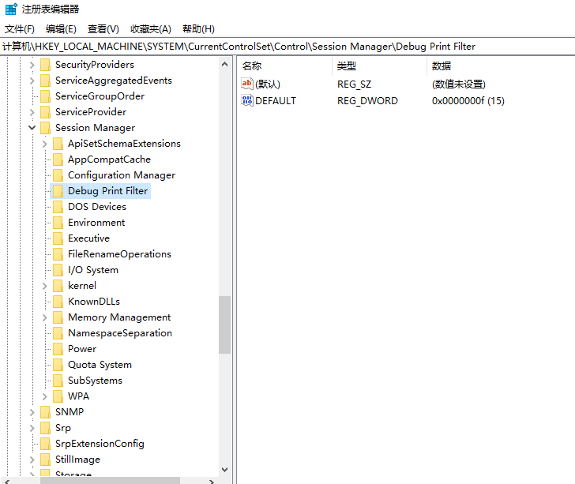

### 部署内核驱动(create)
emaxple
sc create driveTest type=kernel binPath=C:\Users\laser\source\repos\driverTest1\wd\x64\Debug\wd\wd.sys

### set dbgView

dbgView需要在注册表中配置内容才能显示KdPrint的输出，
在\HKEY_LOCAL_MACHINE\SYSTEM\CurrentControlSet\Control\Session Manager\下新建一个项，名为Debug Print Filter，
在Debug Print Filter中添加一个DWORD类型的值，名为DEFAULT，并将其值改为0x0f

### windbg cmd argv

命令行设置调试管道

"C:\Program Files (x86)\Windows Kits\10\Debuggers\x64\windbg.exe" -b -k com:pipe,port=\\.\pipe\com_1,resets=0

### 调试引导(boot debugger)

msconfig

### 禁用驱动强制签名(Disable Driver Force Signing)

设置->更新和安全->恢复->高级启动

F7

